# Praktikum 1: PHP Framework (Codeigniter) 

---

## Tujuan Praktikum

1. Memahami konsep dasar Framework.
2. Memahami konsep dasar MVC (Model-View-Controller).
3. Mampu membuat program sederhana menggunakan Framework CodeIgniter 4.

---

## Langkah-langkah Praktikum

### 1. Persiapan Lingkungan Pengembangan

- **Text Editor:** Menggunakan Visual Studio Code (VSCode).
- **Web Server:** Membuat folder baru dengan nama `lab11_php_ci` di dalam direktori `htdocs` (pada XAMPP).

### 2. Persiapan Awal (Konfigurasi PHP)

**Cara mengaktifkan ekstensi:**
- Buka XAMPP Control Panel.
- Klik Config pada Apache → pilih `PHP.ini`.
- Cari bagian ekstensi, hilangkan tanda titik koma (`;`) pada ekstensi yang akan diaktifkan.
- Simpan file dan restart Apache.

**Screenshot:**

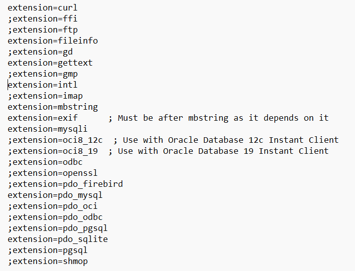

### 3. Instalasi CodeIgniter 4 (Manual)

- Unduh CodeIgniter 4 dari [situs resmi](https://codeigniter.com/download).
- Ekstrak file zip ke direktori `htdocs/lab11_ci`.
- Ubah nama folder `framework-4.x.xx` menjadi `ci4`.
- Buka browser dan akses:  
  `http://localhost/lab11_ci/ci4/public/`

**Screenshot:**

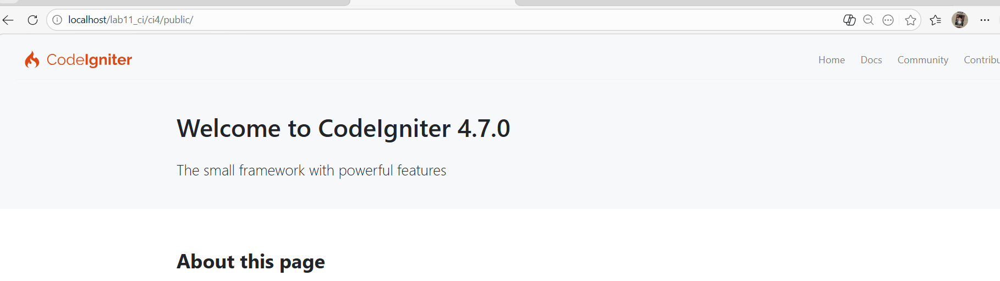

### 4. Menjalankan CLI (Command Line Interface)

- Buka terminal/command prompt.
- Arahkan ke direktori proyek:  
  `cd xampp/htdocs/lab11_ci/ci4/`
- Jalankan perintah CLI CodeIgniter:

  ```bash
  php spark
  ```

**Screenshot:**

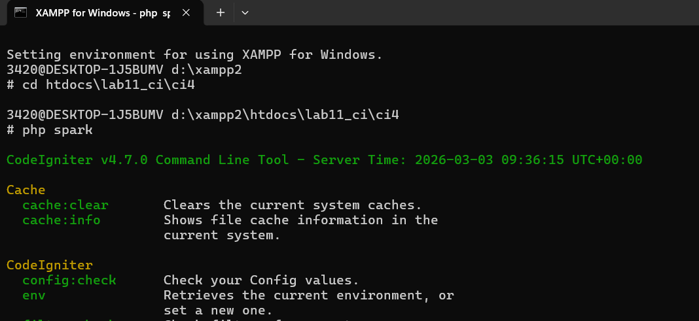

### 5. Mengaktifkan Mode Debugging
Codeigniter 4 menyediakan fitur debugging untuk memudahkan developer untuk mengetahui pesan error apabila terjadi kesalahan dalam membuat kode program. 
Secara default fitur ini belum aktif. Ketika terjadi error pada aplikasi akan ditampilkan pesan kesalahan seperti berikut. 

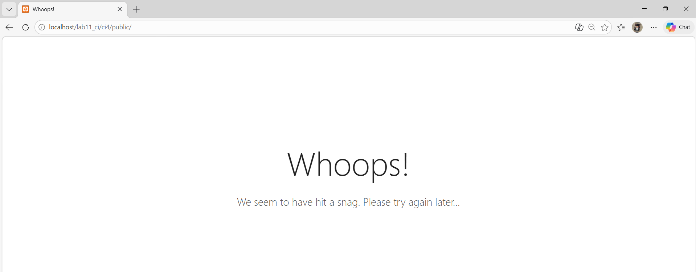

Ubah nama file env menjadi .env kemudian buka file tersebut dan ubah nilai variable CI_ENVIRINMENT menjadi development. 

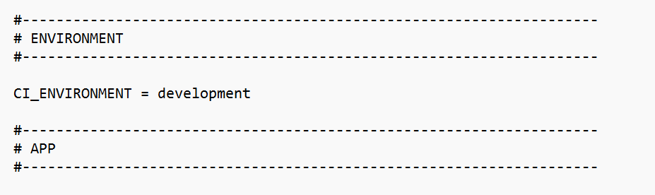

### 6. Routing dan Controller

- Routing diatur dalam file `app/Config/Routes.php`.
- Contoh route default:  

  ```php
  $routes->get('/', 'Home::index');
  ```

**Menambahkan Route Baru:**
```php
$routes->get('/about', 'Page::about');
$routes->get('/contact', 'Page::contact');
$routes->get('/faqs', 'Page::faqs');
$routes->get('page/tos', 'Page::tos');
```

Lalu cek daftar route melalui CLI:
```bash
php spark routes
```

**Screenshot:**

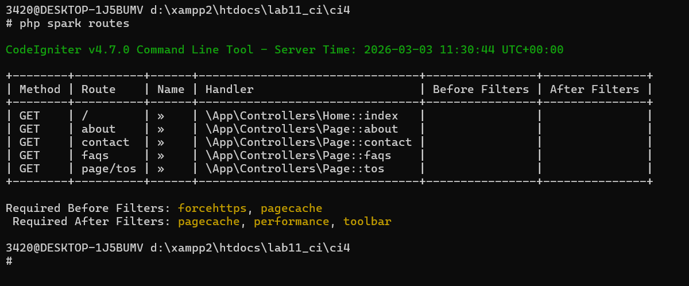

Lalu jalankan server: 
```bash
php spark serve
```

#### 7. Membuat Controller
```php
<?php 

namespace App\Controllers; 

class Page extends BaseController 
{ 
    public function about() 
    { 
        echo "Ini halaman About";
    } 

    public function contact() 
    { 
        echo "Ini halaman Contact"; 
    }
    
    public function faqs() 
    { 
        echo "Ini halaman FAQ"; 
    } 
}
```
Lalu akses route yang telah dibuat dengan mengakses alamat url http://localhost:8080/about

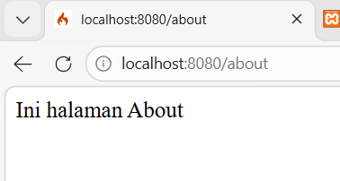

#### 8. Auto Routing
Secara default fitur autoroute pada Codeiginiter sudah aktif. Untuk mengubah status autoroute dapat mengubah nilai variabelnya. Untuk menonaktifkan ubah nilai true menjadi false. 
```php
$routes->setAutoRoute(true); 
```
Tambahkan method baru pada Controller Page seperti berikut. 
```php
public function tos() 
{ 
    echo "ini halaman Term of Services"; 
} 
```
Method ini belum ada pada routing, sehingga cara mengaksesnya dengan menggunakan alamat: http://localhost:8080/page/tos  

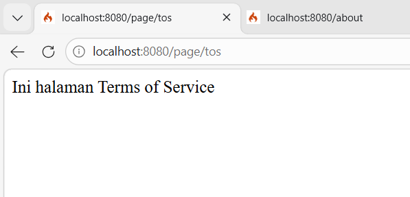

### 9. Membuat View
```html
<!DOCTYPE html> 
<html lang="en"> 
<head> 
    <meta charset="UTF-8"> 
    <title><?= $title; ?></title> 
</head> 
<body> 
    <h1><?= $title; ?></h1> 
    <hr> 
    <p><?= $content; ?></p> 
</body> 
</html> 
```
Ubah method about pada class Controller Page menjadi seperti berikut: 
```php
public function about() 
{ 
    return view('about', [ 
        'title' => 'Halaman About', 
        'content' => 'Ini adalah halaman about yang menjelaskan tentang isi halaman ini.' 
    ]); 
}
```
Setelah itu refresh halaman itu.

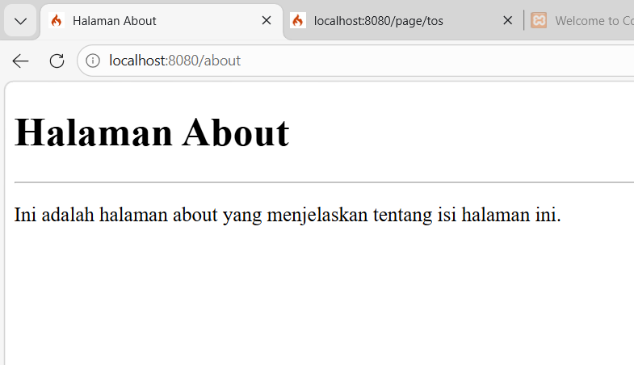

### 10. Membuat Layout Web dengan CSS
Buat file css pada direktori public dengan nama style.css (copy file dari praktikum lab4_layout). Kita akan gunakan layout yang pernah dibuat pada praktikum 4.
```css
/* import google font */
@import
url('https://fonts.googleapis.com/css2?family=Open+Sans:ital,wght@0,300;0,400;0,600;0,700;0,800;1,300;1,400;1,600;1,700;1,800&display=swap');
@import
url('https://fonts.googleapis.com/css2?family=Open+Sans+Condensed:ital,wght@0,300;0,700;1,300&display=swap');
/* Reset CSS */
* {
    margin: 0;
    padding: 0;
}

body {
    line-height:1;
    font-size:100%;
    font-family:'Open Sans', sans-serif;
    color:#5a5a5a;
}

#container {
    width: 980px;
    margin: 0 auto;
    box-shadow: 0 0 1em #cccccc;
}

/* header */
    header {
    padding: 20px;
}
header h1 {
    margin: 20px 10px;
    color: #b5b5b5;
}

/* navigasi */
nav {
    display: block;
    background-color: #1f5faa;
}

nav a{
    padding: 15px 30px;
    display: inline-block;
    color: #ffffff;
    font-size: 14px;
    text-decoration: none;
    font-weight: bold;
}

nav a.active,
nav a:hover {
    background-color: #2b83ea;
}

/* Hero Panel */
#hero {
    background-color: #e4e4e5;
    padding: 50px 20px;
    margin-bottom: 20px;
}

#hero h1 {
    margin-bottom: 20px;
    font-size: 35px;
}

#hero p {
    margin-bottom: 20px;
    font-size: 18px;
    line-height: 25px;
}

#main {
    float: left;
    width: 640px;
    padding: 20px;
}

/* sidebar area */
#sidebar {
    float: left;
    width: 260px;
    padding: 20px;
}

/* widget */
.widget-box {
    border:1px solid #eee;
    margin-bottom:20px;
 }
.widget-box .title {
    padding:10px 16px;
    background-color:#428bca;
    color:#fff;
}
    .widget-box ul {
    list-style-type:none;
}
    .widget-box li {
    border-bottom:1px solid #eee;
}
.widget-box li a {
    padding:10px 16px;
    color:#333;
    display:block;
    text-decoration:none;
}
.widget-box li:hover a {
    background-color:#eee;
}
.widget-box p {
    padding:15px;
    line-height:25px;
}

/* footer */
footer {
    clear: both;
    background-color: #1d1d1d;
    padding: 20px;
    color: #eee;
}

/* box */
.box {
    display:block;
    float:left;
    width:33.333333%;
    box-sizing:border-box;
    -moz-box-sizing:border-box;
    -webkit-box-sizing:border-box;
    padding:0 10px;
    text-align:center;
}
.box h3 {
    margin: 15px 0;
}
.box p {
    line-height: 20px;
    font-size: 14px;
    margin-bottom: 15px;
}
box img {
    border: 0;
    vertical-align: middle;
}
.image-circle {
    border-radius: 50%;
}
.row {
    margin: 0 -10px;
    box-sizing: border-box;
    -moz-box-sizing: border-box;
    -webkit-box-sizing: border-box;
}
.row:after, .row:before,
.entry:after, .entry:before {
    content:'';
    display:table;
}
.row:after,
.entry:after {
    clear:both;
}

.divider {
    border:0;
    border-top:1px solid #eeeeee;
    margin:40px 0;
    }
/* entry */
.entry {
    margin: 15px 0;
}
    .entry h2 {
    margin-bottom: 20px;
}
.entry p {
    line-height: 25px;
}
.entry img {
    float: left;
    border-radius: 5px;
    margin-right: 15px;
}
.entry .right-img {
    float: right;
}

/* Bagian About */
.about-section {
    padding: 40px 20px;
}

.about-section h2 {
    color: #1f5faa;
    margin-bottom: 15px;
}

.about-section p {
    font-size: 18px;
    color: #555;
    line-height: 1.6;
    margin-bottom: 30px;
    max-width: 800px;
}

.portfolio {
    display: flex;
    flex-wrap: wrap;
    justify-content: center;
    gap: 20px;
}

.portfolio-item {
    background-color: #f4f6fa;
    border: 1px solid #e0e0e0;
    border-radius: 8px;
    text-align: center;
    padding: 20px;
    width: 280px;
    transition: all 0.3s ease;
}

.portfolio-item:hover {
    transform: translateY(-5px);
    box-shadow: 0 4px 10px rgba(0,0,0,0.1);
}

.portfolio-item img {
    width: 100%;
    max-width: 220px;
    border-radius: 8px;
    margin-bottom: 10px;
}

.portfolio-item h4 {
    color: #1f5faa;
    margin-bottom: 8px;
    font-size: 18px;
}

.portfolio-item p {
    font-size: 18px;
    color: #666;
    line-height: 1.5;
}

/* Bagian Kontak */
.contact-section {
    padding: 40px 20px;
}

.contact-section h2 {
    color: #1f5faa;
    margin-bottom: 10px;
}

.contact-section p {
    color: #555;
    margin-bottom: 25px;
    font-size: 16px;
}

.contact-form {
    max-width: 500px;
    margin: 0 auto;
    background-color: #f4f6fa;
    border: 1px solid #e0e0e0;
    border-radius: 8px;
    padding: 25px 30px;
}

.contact-form label {
    display: block;
    font-weight: bold;
    color: #333;
    margin-bottom: 5px;
}

.contact-form input,
.contact-form textarea {
    width: 100%;
    padding: 10px;
    border: 1px solid #ccc;
    border-radius: 5px;
    margin-bottom: 15px;
    font-size: 14px;
}

.contact-form textarea {
    resize: vertical;
}

.contact-form button {
    background-color: #1f5faa;
    color: #fff;
    border: none;
    padding: 10px 18px;
    border-radius: 5px;
    cursor: pointer;
    font-size: 15px;
    transition: 0.3s;
}

.contact-form button:hover {
    background-color: #2b83ea;
}

/* Responsif */
@media (max-width: 768px) {
    .portfolio {
        flex-direction: column;
        align-items: center;
    }

    .portfolio-item {
        width: 90%;
    }

    .contact-form {
        width: 90%;
        padding: 20px;
    }
}
```

Kemudian buat folder template pada direktori view kemudian buat file header.php dan footer.php

File app/view/template/header.php
```html
<!DOCTYPE html> 
<html lang="en"> 
<head> 
    <meta charset="UTF-8"> 
    <title><?= $title; ?></title> 
    <link rel="stylesheet" href="<?= base_url('/style.css');?>"> 
</head> 
<body> 
    <div id="container"> 
    <header> 
        <h1>Layout Sederhana</h1> 
    </header> 
    <nav> 
        <a href="<?= base_url('/');?>" class="active">Home</a> 
        <a href="<?= base_url('/artikel');?>">Artikel</a> 
        <a href="<?= base_url('/about');?>">About</a> 
        <a href="<?= base_url('/contact');?>">Kontak</a> 
    </nav> 
    <section id="wrapper"> 
        <section id="main"> 
```
File app/view/template/footer.php
```php
        </section> 
        <aside id="sidebar"> 
            <div class="widget-box"> 
                <h3 class="title">Widget Header</h3> 
                <ul> 
                    <li><a href="#">Widget Link</a></li> 
                    <li><a href="#">Widget Link</a></li> 
                </ul> 
            </div> 
            <div class="widget-box"> 
                <h3 class="title">Widget Text</h3> 
                <p>Vestibulum lorem elit, iaculis in nisl volutpat, 
malesuada tincidunt arcu. Proin in leo fringilla, vestibulum mi porta, 
faucibus felis. Integer pharetra est nunc, nec pretium nunc pretium ac.</p> 
            </div> 
        </aside> 
    </section> 
    <footer> 
        <p>&copy; 2021 - Universitas Pelita Bangsa</p> 
    </footer> 
    </div> 
</body> 
</html> 
```
Kemudian ubah file app/view/about.php
```php
<?= $this->include('template/header'); ?> 
 
<h1><?= $title; ?></h1> 
<hr> 
<p><?= $content; ?></p> 
 
<?= $this->include('template/footer'); ?> 
```
Selanjutnya refresh tampilan pada alamat http://localhost:8080/about 

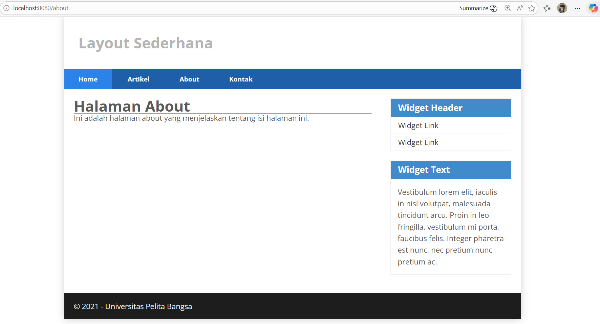

---

# Praktikum 2: Framework Lanjutan (CRUD) 

### 11. Membuat Database & Membuat Table
```sql
CREATE DATABASE lab_ci4;

CREATE TABLE artikel ( 
    id INT(11) auto_increment, 
    judul VARCHAR(200) NOT NULL, 
    isi TEXT, 
    gambar VARCHAR(200), 
    status TINYINT(1) DEFAULT 0, 
    slug VARCHAR(200), 
    PRIMARY KEY(id) 
); 
```

Selanjutnya membuat konfigurasi untuk menghubungkan dengan database server.


### 12. Membuat Model
Buat file baru pada direktori app/Models dengan nama `ArtikelModel.php`
```php
<?php

namespace App\Models;

use CodeIgniter\Model;

class ArtikelModel extends Model
{
    protected $table = 'artikel';
    protected $primaryKey = 'id';
    protected $useAutoIncrement = true;
    protected $allowedFields = ['judul', 'isi', 'status', 'slug', 'gambar'];
}
```

### 13. Membuat Controller
Buat Controller baru dengan nama `artikel.php` pada direktori app/Controllers. 
```php
<?php

namespace App\Controllers;

use App\Models\ArtikelModel;

class Artikel extends BaseController
{
    public function index()
    {
        $title = 'Daftar Artikel';
        $model = new ArtikelModel();
        $artikel = $model->findAll();
        return view('artikel/index', compact('title', 'artikel'));
    }
}
```

### 13. Membuat View
Buat direktori baru dengan nama artikel pada direktori app/views, kemudian buat file baru dengan nama `index.php.` 
```php
<?= $this->include('template/header'); ?> 

<?php if($artikel): foreach($artikel as $row): ?> 
<article class="entry">
    <h2> <a href="<?= base_url('/artikel/' . $row['slug']);?>"><?= $row['judul']; ?></a>
</h2>
    " alt="<?= $row['judul']; ?>">
    <p><?= substr($row['isi'], 0, 200); ?></p> 
</article>
<hr class="divider" /> 
<?php  endforeach; else: ?> 
<article class="entry"> 
    <h2>Belum ada data.</h2> 
</article> 
<?php endif; ?> 

<?= $this->include('template/footer'); ?>
```

Selanjutnya buka browser kembali, dengan mengakses url http://localhost:8080/artikel  


Lalu  tambahkan beberapa data pada database agar dapat ditampilkan datanya.

```
INSERT INTO artikel (judul, isi, slug) VALUE  
('Artikel pertama', 'Lorem Ipsum adalah contoh teks atau dummy dalam industri percetakan dan penataan huruf atau typesetting. Lorem Ipsum telah menjadi standar contoh teks sejak tahun 1500an, saat seorang tukang cetak yang tidak dikenal mengambil sebuah kumpulan teks dan mengacaknya untuk menjadi sebuah buku contoh huruf.', 'artikel-pertama'),  
('Artikel kedua', 'Tidak seperti anggapan banyak orang, Lorem Ipsum bukanlah teks-teks yang diacak. Ia berakar dari sebuah naskah sastra latin klasik dari era 45 sebelum masehi, hingga bisa dipastikan usianya telah mencapai lebih dari 2000 tahun.', 'artikel-kedua');
```
Refresh kembali browser.


### 14. Membuat Tampilan Detail Artikel 
Tambahkan fungsi baru pada Controller Artikel dengan nama view(). 
```php
 public function view($slug) 
    { 
        $model = new ArtikelModel(); 
        $artikel = $model->where([ 
            'slug' => $slug 
        ])->first(); 
 
        // Menampilkan error apabila data tidak ada. 
        if (!$artikel)  
        { 
            throw PageNotFoundException::forPageNotFound(); 
        } 
 
        $title = $artikel['judul']; 
        return view('artikel/detail', compact('artikel', 'title')); 
    } 
```

### 15. Membuat View Detail
Buat view baru untuk halaman detail dengan nama app/views/artikel/`detail.php`

```php
<?= $this->include('template/header'); ?> 

<article class="entry"> 
    <h2><?= $artikel['judul']; ?></h2> 
    " alt="<?= $artikel['judul']; ?>"> 
    <p><?= $artikel['isi']; ?></p> 
</article> 

<?= $this->include('template/footer'); ?>  
```
Lalu buka Kembali file app/config/Routes.php, kemudian tambahkan routing untuk artikel detail. 

```php
$routes->get('/artikel', 'Artikel::index');
$routes->get('/artikel/(:any)', 'Artikel::view/$1'); 
```
Lalu buka browser dengan mengakses url http://localhost:8080/artikel/artikel-pertama

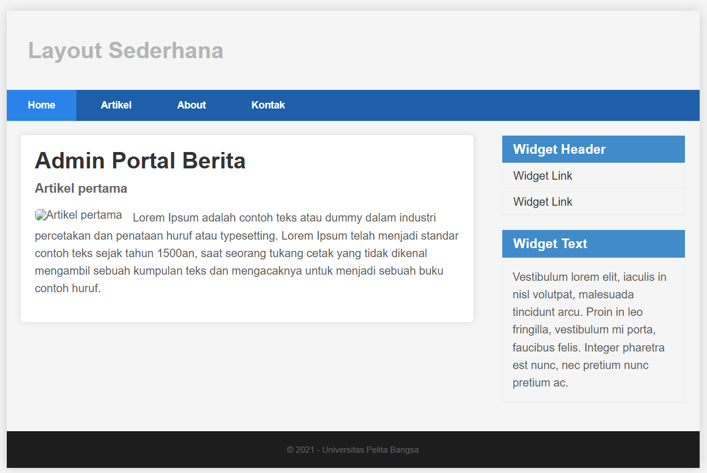

### 16. Membuat Menu Admin 
Buat method baru pada Controller Artikel dengan nama admin_index().

```php
public function admin_index()  
{ 
    $title = 'Daftar Artikel'; 
    $model = new ArtikelModel(); 
    $artikel = $model->findAll(); 
    return view('artikel/admin_index', compact('artikel', 'title')); 
}
```
Lalu buat file `admin_index.php` di dalam views/artikel untuk tampilan admin.

```php
<?= $this->include('template/header'); ?>

<h2>Dashboard | Artikel | Tambah Artikel</h2>

<table class="table">
    <thead>
        <tr>
            <th>ID</th>
            <th>Judul</th>
            <th>Status</th>
            <th>AKsi</th>
        </tr>
    </thead>
    <tbody>
        <?php if($artikel): foreach($artikel as $row): ?>
        <tr>
            <td><?= $row['id']; ?></td>
            <td>
                <b><?= $row['judul']; ?></b>
                <p><small><?= substr($row['isi'], 0, 50); ?></small></p>
            </td>
            <td><?= $row['status']; ?></td>
            <td>
                <a class="btn" href="<?= base_url('/admin/artikel/edit/' . $row['id']); ?>">Ubah</a>
                <a class="btn btn-danger" onclick="return confirm('Yakin menghapus data?');" href="<?= base_url('/admin/artikel/delete/' . $row['id']); ?>">Hapus</a>
            </td>
        </tr>
        <?php endforeach; else: ?>
        <tr>
            <td colspan="4">Belum ada data.</td>
        </tr>
        <?php endif; ?>
    </tbody>
    <tfoot>
        <tr>
            <th>ID</th>
            <th>Judul</th>
            <th>Status</th>
            <th>AKsi</th>
        </tr>
    </tfoot>
</table>

<?= $this->include('template/footer'); ?>
```

Tambahkan routing untuk menu admin seperti berikut: 

```php
$routes->group('admin', function($routes) {
    $routes->get('artikel', 'Artikel::admin_index');
    $routes->add('artikel/add', 'Artikel::add');
    $routes->add('artikel/edit/(:any)', 'Artikel::edit/$1');
    $routes->get('artikel/delete/(:any)', 'Artikel::delete/$1');
});
```

Tambahkan code dibawah dalam file `header.php` :

```
<title>Admin Portal Berita</title>
    <style>
        body {
            font-family: Arial, sans-serif;
            margin: 0;
            padding: 20px;
            background: #f5f5f5;
        }
        .container {
            max-width: 1000px;
            margin: 0 auto;
            background: white;
            padding: 20px;
            border-radius: 5px;
            box-shadow: 0 0 10px rgba(0,0,0,0.1);
        }
        h1 {
            color: #333;
            margin-top: 0;
        }
        h2 {
            color: #666;
            font-size: 18px;
            margin-bottom: 20px;
        }
        table {
            width: 100%;
            border-collapse: collapse;
            margin-bottom: 20px;
        }
        th {
            background: #f2f2f2;
            text-align: left;
            padding: 10px;
            border: 1px solid #ddd;
        }
        td {
            padding: 10px;
            border: 1px solid #ddd;
        }
        td p {
            margin: 5px 0 0 0;
            color: #666;
        }
        .btn {
            display: inline-block;
            padding: 5px 10px;
            background: #007bff;
            color: white;
            text-decoration: none;
            border-radius: 3px;
            font-size: 12px;
        }
        .btn-danger {
            background: #dc3545;
        }
        footer {
            margin-top: 20px;
            text-align: center;
            color: #666;
            font-size: 12px;
        }
    </style>
</head>
<body>
    <div class="container">
        <h1>Admin Portal Berita</h1>
```

Akses menu admin dengan url http://localhost:8080/admin/artikel 

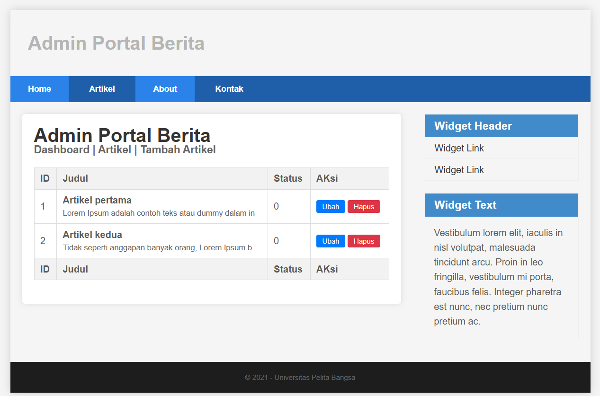

### 17. Menambah Data Artikel
Tambahkan fungsi/method baru pada Controller Artikel dengan nama add(). 

```php
public function add()
    { 
    // validasi data. 
    $validation =  \Config\Services::validation(); 
    $validation->setRules(['judul' => 'required']); 
    $isDataValid = $validation->withRequest($this->request)->run(); 
    
    if ($isDataValid) 
    { 
        $artikel = new ArtikelModel(); 
        $artikel->insert([ 
            'judul' => $this->request->getPost('judul'),
            'isi' => $this->request->getPost('isi'), 
            'slug' => url_title($this->request->getPost('judul')), 
        ]); 
        return redirect('admin/artikel'); 
    } 
    $title = "Tambah Artikel"; 
    return view('artikel/form_add', compact('title')); 
    } 
```
Kemudian buat file `form_add.php` di dalam views/artikel untuk form tambah.

```php
<?= $this->include('template/header'); ?> 
<h2><?= $title; ?></h2> 
<form action="" method="post"> 
    <p> 
        <input type="text" name="judul"> 
    </p> 
    <p> 
        <textarea name="isi" cols="50" rows="10"></textarea> 
    </p> 
    <p><input type="submit" value="Kirim" class="btn btn-large"></p> 
</form> 
<?= $this->include('template/footer'); ?>
```

Akses menu tambah dengan url http://localhost:8080/admin/artikel/add

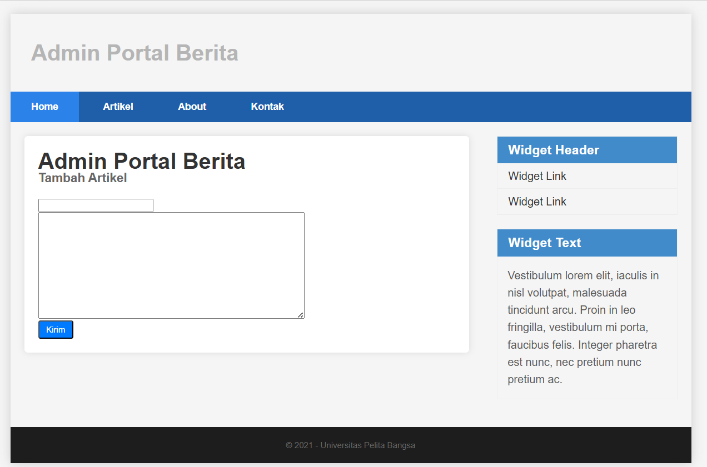


### 18. Mengubah Data
Tambahkan fungsi/method baru pada Controller Artikel dengan nama edit().  

```php
public function edit($id)  
    { 
        $artikel = new ArtikelModel(); 
 
        // validasi data. 
        $validation =  \Config\Services::validation(); 
        $validation->setRules(['judul' => 'required']); 
        $isDataValid = $validation->withRequest($this->request)->run(); 
 
        if ($isDataValid) 
        { 
            $artikel->update($id, [ 
                'judul' => $this->request->getPost('judul'), 
                'isi' => $this->request->getPost('isi'), 
            ]); 
            return redirect('admin/artikel'); 
        } 
 
        // ambil data lama 
        $data = $artikel->where('id', $id)->first(); 
        $title = "Edit Artikel"; 
        return view('artikel/form_edit', compact('title', 'data')); 
    }
```

Kemudian buat file `form_edit.php` di dalam views/artikel untuk form edit.

```php
<?= $this->include('template/header'); ?> 
 
<h2><?= $title; ?></h2> 
<form action="" method="post"> 
    <p> 
        <input type="text" name="judul" value="<?= $data['judul'];?>" > 
    </p> 
    <p> 
        <textarea name="isi" cols="50" rows="10"><?= $data['isi'];?></textarea> 
    </p> 
    <p><input type="submit" value="Kirim" class="btn btn-large"></p> 
</form> 
 
<?= $this->include('template/footer'); ?>
```

Akses menu edit dengan url http://localhost:8080/admin/artikel/edit/1

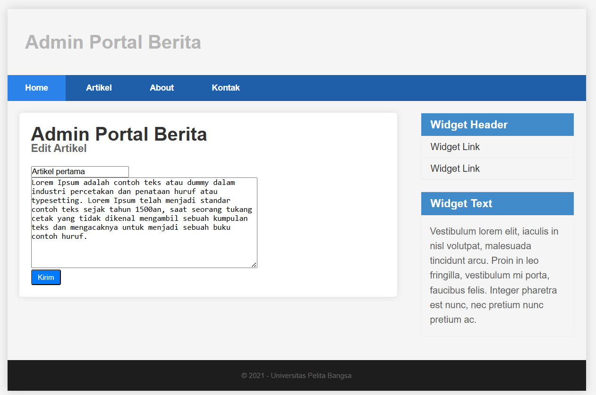

### 19. Menghapus Data
Tambahkan fungsi/method baru pada Controller Artikel dengan nama delete().  

```php
public function delete($id)  
    { 
        $artikel = new ArtikelModel(); 
        $artikel->delete($id); 
        return redirect('admin/artikel'); 
    }
```
Proses hapus artikel pertama:


Setelah hapus artikel pertama:


<<<<<<< HEAD

---

# Praktikum 3: View Layout dan View Cell - CodeIgniter 4

## Tujuan Praktikum
- Memahami konsep View Layout di CodeIgniter 4
- Menggunakan View Layout untuk membuat template tampilan
- Memahami dan mengimplementasikan View Cell
- Menggunakan View Cell untuk memanggil komponen UI secara modular


## Langkah-langkah Praktikum

### 1. Membuat Layout Utama
Membuat file `app/Views/layout/main.php` yang berisi struktur HTML dasar (header, nav, sidebar, footer, dan section `<?= $this->renderSection('content') ?>` untuk tempat konten dinamis.

### 2. Modifikasi File View
Mengubah file `home.php`, `artikel.php`, dll agar menggunakan layout dengan sintaks:
```php
<?= $this->extend('layout/main') ?>

<?= $this->section('content') ?>
<h1><?= $title; ?></h1>
<hr>
<p><?= $content; ?></p>
<?= $this->endSection() ?>
```

### 3. Menambahkan Kolom created_at pada Database
Menambahkan kolom created_at untuk mengurutkan artikel berdasarkan tanggal terbaru:
```
ALTER TABLE artikel ADD COLUMN created_at DATETIME DEFAULT CURRENT_TIMESTAMP;
```

### 4. Membuat View Cell
- Class Cell: `app/Cells/ArtikelTerkini.php` → berisi logika mengambil 5 artikel terbaru dari database.
- View Komponen: `app/Views/components/artikel_terkini.php` → menampilkan daftar artikel dalam bentuk list HTML.
- Pemanggilan di layout: `<?= view_cell('App\\Cells\\ArtikelTerkini::render') ?>`

### 📸 Screenshot Hasil

1. Struktur Database

    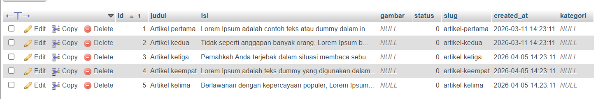

2. Tampilan Halaman Home

    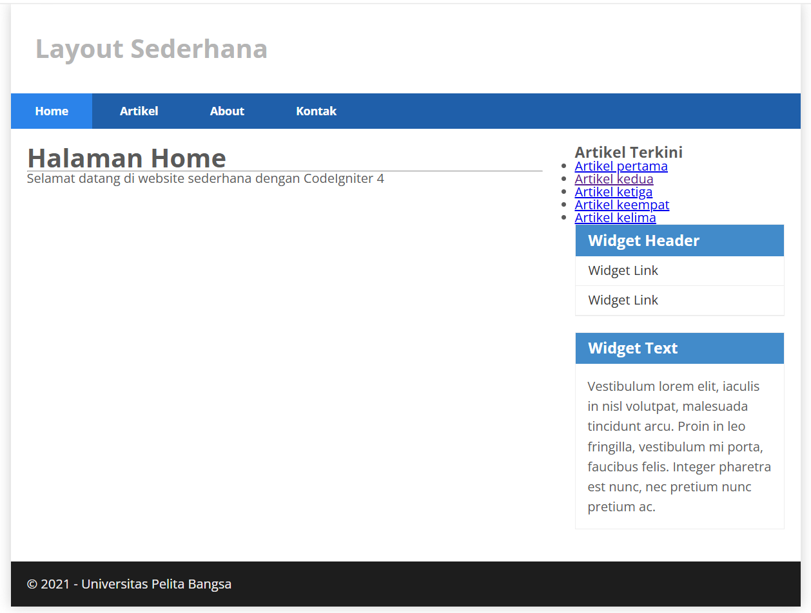

3. View Cell di Sidebar

    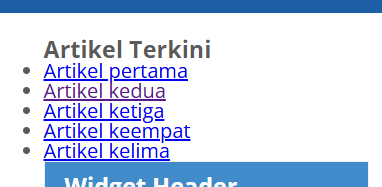


## Pertanyaan dan Tugas

1. Apa manfaat utama dari penggunaan View Layout dalam pengembangan aplikasi?

Jawaban: Manfaat utama pakai View Layout itu kita jadi gak perlu ngulang-ngulang kode HTML untuk header, footer, dan sidebar di setiap halaman. Cukup bikin satu file layout, terus halaman lain tinggal panggil aja. Jadi kalau mau ganti tampilan, cukup edit satu file, otomatis semua halaman ikut berubah. Ini sangat membantu karena kode jadi lebih rapi dan gak ribet kalau mau maintenance. Selain itu, proses bikin website juga jadi lebih cepat karena kita tinggal fokus ke kontennya aja, gak perlu mikirin layout terus-terusan.

2. Jelaskan perbedaan antara View Cell dan View biasa

Jawaban: Perbedaan utama antara View Cell dan View biasa itu ada di cara manggil dan dari mana datanya datang. View biasa itu dipanggil dari Controller, contohnya return view('home'). Datanya juga dikirim dari Controller, jadi Controller yang nyiapin data dulu baru dikirim ke View Sedangkan View Cell dipanggil dari dalam View atau Layout, pake fungsi view_cell(). Yang membedakan, View Cell itu bisa ambil data sendiri langsung dari Model, gak perlu lewat Controller dulu. Jadi lebih mandiri gitu. View biasa cocoknya buat halaman utama kayak home, about, contact. Sementara View Cell lebih cocok buat komponen-komponen kecil yang muncul di banyak halaman, misalnya sidebar artikel terbaru, widget, atau menu. Karena View Cell bisa dipake berulang-ulang di mana aja tanpa perlu nulis ulang kode.

3. Ubah View Cell agar hanya menampilkan post dengan kategori tertentu

Jawaban:
Untuk bikin View Cell cuma nampilin artikel dengan kategori tertentu, pertama saya tambahin dulu kolom kategori di tabel artikel pake SQL:

```sql
ALTER TABLE artikel ADD COLUMN kategori VARCHAR(50);

```

Lalu isi datanya, misalnya artikel pertama saya kasih kategori `'php'`, artikel kedua juga `'php'`.

```sql
UPDATE artikel SET kategori = 'php' WHERE id = 1;
UPDATE artikel SET kategori = 'php' WHERE id = 2;
UPDATE artikel SET kategori = 'javascript' WHERE id = 3;
UPDATE artikel SET kategori = 'javascript' WHERE id = 4;
UPDATE artikel SET kategori = 'javascript' WHERE id = 5;
```

Selanjutnya ubah file View Cell-nya di `app/Cells/ArtikelTerkini.php`. Tambahkan parameter `$kategori` di method render, terus kasih kondisi `if`. Kalau parameter kategorinya diisi, maka query akan nambah where kategori = nilai parameter itu. Kurang lebih kodenya jadi gini:

```php
public function render(string $kategori = null)
{
    $model = new ArtikelModel();
    $query = $model->orderBy('created_at', 'DESC');
    
    if ($kategori) {
        $query->where('kategori', $kategori);
    }
    
    $artikel = $query->limit(5)->findAll();
    return view('components/artikel_terkini', ['artikel' => $artikel]);
}
```

Terakhir, pas manggil View Cell di file layout main.php, saya tulis seperti ini:

```php
<?= view_cell('App\\Cells\\ArtikelTerkini::render', ['kategori' => 'php']) ?>
```

Hasilnya, di sidebar cuma muncul artikel yang kategorinya `'php'` aja. Kalau saya ganti parameternya jadi `'javascript'`, maka yang muncul ya artikel dengan kategori itu. Kalau mau nampilin semua artikel lagi, tinggal panggil tanpa parameter.

Dari percobaan saya, sebelumnya sidebar nampilin semua artikel terbaru tanpa peduli kategorinya. Setelah ditambah filter ini, sidebar jadi lebih spesifik dan cuma nampilin sesuai kebutuhan.

### 📸 Screenshot Hasil

Before

 

After


---

# Praktikum 4: Framework Lanjutan (Modul Login)

## Deskripsi
Praktikum ini bertujuan untuk memahami konsep dasar Authentication (Auth) dan Filter pada framework CodeIgniter 4, serta membuat sistem login yang dapat melindungi halaman admin.

## Tujuan
1. Mahasiswa mampu memahami konsep dasar Auth dan Filter.
2. Mahasiswa mampu memahami konsep dasar Login System.
3. Mahasiswa mampu membuat modul login menggunakan Framework CodeIgniter 4.

---

## Langkah-langkah Praktikum

### 1. Persiapan Database
Pastikan MySQL Server berjalan melalui XAMPP. Buat database baru (jika belum ada) untuk proyek ini.

### 2. Membuat Tabel User
Jalankan query berikut di phpMyAdmin:

```sql
CREATE TABLE user (
    id INT(11) auto_increment,
    username VARCHAR(200) NOT NULL,
    useremail VARCHAR(200),
    userpassword VARCHAR(200),
    PRIMARY KEY(id)
);
```

### 3. Membuat Model User
Buat file `app/Models/UserModel.php`:

```php
<?php 
 
namespace App\Models; 
 
use CodeIgniter\Model; 
 
class UserModel extends Model 
{ 
    protected $table = 'user'; 
    protected $primaryKey = 'id';
     protected $useAutoIncrement = true; 
    protected $allowedFields = ['username', 'useremail', 'userpassword']; 
} 
```

### 4. Membuat Controller User
Buat file `app/Controllers/User.php`:


```php
<?php

namespace App\Controllers;

use App\Models\UserModel;

class User extends BaseController
{
    public function index()
    {
        $title = 'Daftar User';
        $model = new UserModel();
        $users = $model->findAll();
        return view('user/index', compact('users', 'title'));
    }

    public function login()
    {
        helper(['form']);
        $email = $this->request->getPost('email');
        $password = $this->request->getPost('password');

        if (!$email) {
            return view('user/login');
        }

        $session = session();
        $model = new UserModel();
        $login = $model->where('useremail', $email)->first();

        if ($login) {
            $pass = $login['userpassword'];
            if (password_verify($password, $pass)) {
                $login_data = [
                    'user_id' => $login['id'],
                    'user_name' => $login['username'],
                    'user_email' => $login['useremail'],
                    'logged_in' => TRUE,
                ];
                $session->set($login_data);
                return redirect('admin/article');
            } else {
                $session->setFlashdata("flash_msg", "Password salah.");
                return redirect()->to('/user/login');
            }
        } else {
            $session->setFlashdata("flash_msg", "email tidak terdaftar.");
            return redirect()->to('/user/login');
        }
    }

    public function getLogin()
    {
        return $this->login();
    }

    public function logout()
    {
        session()->destroy(); 
        return redirect()->to('/user/login');
    }  
}
```

### 5. Membuat View Login
Buat folder `app/views/user/` lalu buat file `login.php`:

```html
<!DOCTYPE html>
<html lang="en">
<head>
    <meta charset="UTF-8">
    <title>Login</title>
    <style>
        body {
            margin: 0;
            padding: 0;
            font-family: 'Segoe UI', Tahoma, Geneva, Verdana, sans-serif;
            background: #e9ecef;
            display: flex;
            justify-content: center;
            align-items: center;
            min-height: 100vh;
        }

        #login-wrapper {
            background: white;
            padding: 40px;
            border-radius: 5px;
            box-shadow: 0 2px 10px rgba(0, 0, 0, 0.1);
            width: 380px;
            text-align: left;
        }

        #login-wrapper h1 {
            margin: 0 0 25px 0;
            font-size: 24px;
            color: #333;
            font-weight: normal;
            font-weight: bold;
        }

        .mb-3 {
            margin-bottom: 20px;
            text-align: left;
        }

        .form-label {
            display: block;
            margin-bottom: 8px;
            font-weight: normal;
            color: #333;
            font-size: 14px;
        }

        .form-control {
            width: 100%;
            padding: 10px;
            border: 1px solid #ccc;
            border-radius: 4px;
            font-size: 14px;
            box-sizing: border-box;
        }

        /* TOMBOL WARNA ABU-ABU/ITEM, SAMA PERSIS MODUL */
        .btn-primary {
            background: #6c757d;
            color: white;
            border: none;
            padding: 10px 20px;
            border-radius: 4px;
            cursor: pointer;
            width: 100%;
            font-size: 16px;
        }

        .btn-primary:hover {
            background: #5a6268;
        }

        .alert {
            padding: 10px;
            border-radius: 4px;
            margin-bottom: 20px;
            font-size: 14px;
        }

        .alert-danger {
            background: #f8d7da;
            color: #721c24;
            border: 1px solid #f5c6cb;
        }
    </style>
</head>
<body>
    <div id="login-wrapper">
        <h1>Sign In</h1>
        <?php if(session()->getFlashdata('flash_msg')):?>
            <div class="alert alert-danger"><?= session()->getFlashdata('flash_msg') ?></div>
        <?php endif;?>
        <form action="" method="post">
            <div class="mb-3">
                <label for="InputForEmail" class="form-label">Email address</label>
                <input type="email" name="email" class="form-control" id="InputForEmail" value="<?= set_value('email') ?>">
            </div>
            <div class="mb-3">
                <label for="InputForPassword" class="form-label">Password</label>
                <input type="password" name="password" class="form-control" id="InputForPassword">
            </div>
            <button type="submit" class="btn btn-primary">Login</button>
        </form>
    </div>
</body>
</html>
```

### 6. Membuat Database Seeder
Jalankan perintah berikut di terminal Xampp:
```bash
php spark make:seeder UserSeeder
```

Lalu buka `app/Database/Seeds/UserSeeder.php` dan isi dengan:

```php
<?php 
 
namespace App\Database\Seeds; 
 
use CodeIgniter\Database\Seeder; 
 
class UserSeeder extends Seeder 
{ 
    public function run() 
    { 
        $model = model('UserModel'); 
        $model->insert([ 
            'username' => 'admin', 
            'useremail' => 'admin@email.com', 
            'userpassword' => password_hash('admin123', PASSWORD_DEFAULT), 
        ]); 
    } 
}
```

Kembali lagi ke terminal, jalankan seeder:
```bash
php spark db:seed UserSeeder
```

### 7. Mengatur Routes
Buka `app/Config/Routes.php` lalu tambahkan code di bawah ini untuk uji coba:
```php
$routes->get('/user/login', 'User::login');
$routes->post('/user/login', 'User::login');
$routes->get('/user/logout', 'User::logout');
```

### 8. Uji Coba Login 
Selanjutnya buka url http://localhost:8080/user/login lalu muncul halaman login seperti berikut:

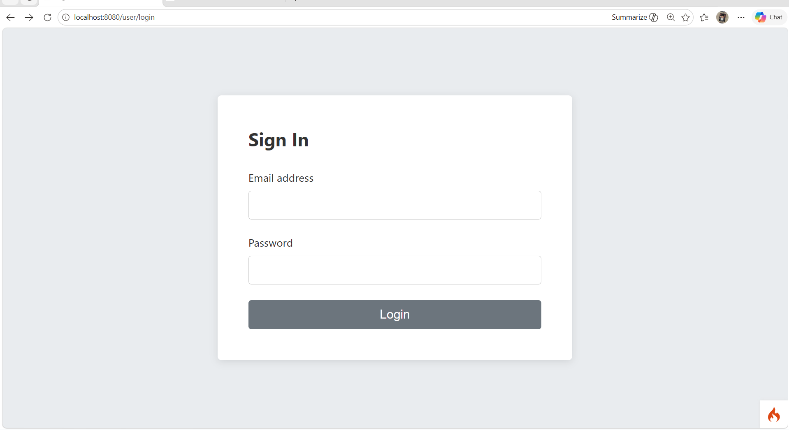

### 9. Membuat Auth Filter
Buat folder `app/Filters/` lalu buat file `Auth.php`:
```php
<?php namespace App\Filters; 
  
use CodeIgniter\HTTP\RequestInterface; 
use CodeIgniter\HTTP\ResponseInterface; 
use CodeIgniter\Filters\FilterInterface; 
  
class Auth implements FilterInterface 
{ 
    public function before(RequestInterface $request, $arguments = null) 
    { 
        // jika user belum login 
        if(! session()->get('logged_in')){ 
            // maka redirct ke halaman login 
            return redirect()->to('/user/login'); 
        } 
    } 
  
    public function after(RequestInterface $request, ResponseInterface 
$response, $arguments = null) 
    { 
        // Do something here 
    } 
} 
```

### 10. Mendaftarkan Filter
Buka `app/Config/Filters.php` dan tambahkan `'auth'          => \App\Filters\Auth::class,` di `public array $aliases` seperti dibawah ini:

```php
public array $aliases = [
        'csrf'          => CSRF::class,
        'toolbar'       => DebugToolbar::class,
        'honeypot'      => Honeypot::class,
        'auth'          => \App\Filters\Auth::class,  
        'invalidchars'  => InvalidChars::class,
        'secureheaders' => SecureHeaders::class,
        'cors'          => Cors::class,
        'forcehttps'    => ForceHTTPS::class,
        'pagecache'     => PageCache::class,
        'performance'   => PerformanceMetrics::class,
    ];
```

Selanjutnya buka file `app/Config/Routes.php` dan tambahkan code dibawah ini untuk uji coba:
```php
$routes->get('/admin/artikel', 'Artikel::admin_index', ['filter' => 'auth']);
$routes->get('/admin/artikel/add', 'Artikel::add', ['filter' => 'auth']);
$routes->post('/admin/artikel/add', 'Artikel::add', ['filter' => 'auth']);
$routes->get('/admin/artikel/edit/(:any)', 'Artikel::edit/$1', ['filter' => 'auth']);
$routes->post('/admin/artikel/edit/(:any)', 'Artikel::edit/$1', ['filter' => 'auth']);
$routes->get('/admin/artikel/delete/(:any)', 'Artikel::delete/$1', ['filter' => 'auth']);
```

### 11. Percobaan Akses Menu Admin 
Buka url dengan alamat http://localhost:8080/admin/artikel ketika alamat tersebut diakses maka, akan dimuculkan halaman login.

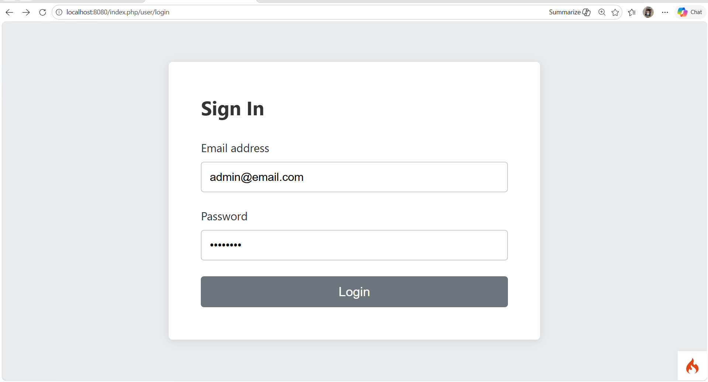

Dan ini setelah admin login


Note: Login menggunakan email address & password yang sudah kamu ketik di `app/Database/Seeds/UserSeeder.php`

### 12. Fungsi Logout
Tambahkan method logout pada `app/Controllers/User.php` seperti berikut:
```php
public function logout()
    {
        session()->destroy(); 
        return redirect()->to('/user/login');
    }  
```

Akses URL: http://localhost:8080/user/logout

Setelah logout, akan diarahkan kembali ke halaman login.

---

## Author

Nama : Safitri Eka Ramadhani

NIM : 312410431

Kelas : I241C
